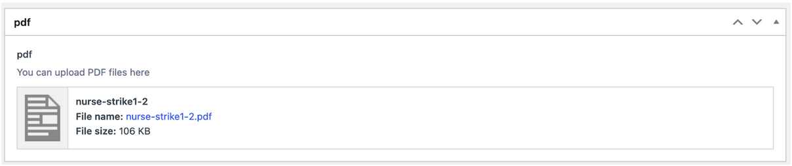

# Useful links

[WP admin](https://vitalsignscontenteditor.co.uk/wp-admin)
[Vercel Deploy](https://vercel.com/jones58s-projects/vital-signs/settings/domains)
[Live site](https://www.vitalsignsmag.org/)
[Are.na inspo here](https://www.are.na/jack-kershaw/vitalsigns)

# Planning

- Because the client was already confident using Wordpress for a previous site, I decided to use NextJS for the frontend with Headless Wordpress as the backend. There are several reasons for this over just traditional Wordpress - the primary ones being speed and security.

- NextJS allows me to use static regeneration - a hybrid of server side rendering and static site generation.

- Designed the site, first by sketching it and then building it in Figma.

# Building

- As this is my first time using NextJS, I decided to use Vercel's NextJS and Wordpress example to bootstrap the project:

```bash
npx create-next-app --example cms-wordpress cms-wordpress-app
```

- I was hesistant to use this example, because it might complicate the project and make it harder for me to work on it but in the end, I decided to use it, and make sure to read through the code to make sure I understood it.

- Secured vitalsignsmag.org domain on Porkbun for 1 year.
- Got Siteground wordpress hosting with 1 year free domain, vitalsignscontenteditor.co.uk

- Installed the [WPGraphQL](https://www.wpgraphql.com/) plugin - which will be used to create an API for the posts.

- Added some dummy content - two posts - which will be used for testing.

  - Within these posts I added excerpts and featured images.

- Created an .env.local file and added the Wordpress API URL for WPGraphQL plugin. Added this to gitignore

- Ran Next.js in development mode using the commands below.
  - This gave me an image error - but [the docs](https://nextjs.org/docs/messages/next-image-unconfigured-host) explained how to fix this by changing the domain path in the next.config.js file.
- Deployed on Vercel via Github, adding the environment variables.
- Removed the extra content from the Vercel example I bootstrapped this project off. I also made sure to read through the code to make sure I understood it.
- Added categories:
  - I decided to set up the following categories for posts on the site:
    - Working Conditions
    - International
    - Current Struggles
    - Debate
    - History
    - Leaflets
    - Newsletters
    - Meetings
    - Issue 1
    - Issue 2
    - Issue 3
- Added content
  - I used draft content supplied by the client to get some key posts on the site. I used stock images from Unsplash for now, to test the image sizing across the site.
- Added Charter and Libre Franklin fonts to the site. With Libre Franklin, although I only needed one font weight for the titles, this was my first time using a variable font and something I will definitely look at using again. It allowed rapid prototyping of font weight on the site.
- Added Iconify to the site via Tailwind.
- Read up about [Image components](https://nextjs.org/docs/pages/api-reference/components/image) in NextJS, and decided to use the following structure, wrapping the images in a div to better set their size:
  <div className="h-[20vh] w-[20vw] relative">
  <Image
              src="/images/banner-draft.png"
              alt="logo"
              fill
              className="object-cover"
            />
  </div>
- I found it particularly difficult to add category queries to the site, but after some time using the GraphQL IDE on Wordpress, I managed to edit the API and then reference the API in components.
- Added rudimentary favicon based off the banner design.
- I then set up the About page as something the client could edit in Wordpress. I used the GraphQL IDE in Wordpress to find and test the correct API command and then added the content to my about page.

  ```graphql
  query getAboutPageContent {
    pages(where: { name: "about" }) {
      nodes {
        content
      }
    }
  }
  ```

- I had an issue loading fonts when deployed on Vercel. Whilst it worked locally, I had to make some changes using Next/font to get it to work. The documentation [here](https://nextjs.org/docs/pages/building-your-application/optimizing/fonts#local-fonts) proved very valuable.

- Added some animations with Framer Motion. For now, I have gone for a simple fade in from the bottom with a slight delay, between each page. This is wrapped around the layout component rather than the whole site. So, the header and footer are not animated.

- Improved the site's SEO using [the NextJS docs](https://nextjs.org/docs/app/building-your-application/optimizing/metadata). I added static metadata to the Layout file, as well as dynamic metadata for each page. I used [OpenGraph.xyz](https://www.opengraph.xyz) to test how links would appear when shared on social media.

- Added MIT License.

- RSS: I have kept this simple and just added a link to the RSS feed that Worpdress generates rather than creating something in NextJS. I created a /feed page in NextJS which automatically redirects to this URL, to enable the same sort of functionality in NextJS that Wordpress offers.

- Added a custom 404 page to the site, using a page titled 404 in the NextJS pages router.

- Added a read more button to the bottom of the home page which links to the news page.

- Used framer motion to add animation to my header opening and closing on mobile. Because of the nature of animating this, I found it simpler to have separate code for mobile and desktop here.

- Ran Google Lighthouse to improve Accessibility, reaching a score of 100 after the following edits:

  - Added aria-label for menu button in header on mobile, and other links in header.
  - make main top level component in layout

- updated to latest version of nextjs

- Made layout changes across the site. I went for a mobile-first approach to this, making sure the mobile site looked clean and used up the available width before moving to desktop.

- When the client asked me make the red of the page brighter, I was inititally a bit worried since using bright colours can reduce accessibility. I used [Tailwind Shades](https://www.tailwindshades.com/#color=360%2C84.68085106382979%2C46.07843137254902&step-up=6&step-down=12&hue-shift=10&name=crimson&base-stop=7&v=1&overrides=eyIwLjUiOnsiaHVlIjowLCJzYXR1cmF0aW9uIjotMSwibGlnaHRuZXNzIjotMSwiaGV4IjoiRjlCOUI5IiwidGV4dENvbG9yIjoiYmxhY2sifX0%3D) to help me iterate through different options. Using the same colour name I had used across the site already,"orange", as the colour to extend while testing worked well and helped me see live updates across the site quickly.I consulted the WCAG Contrast Checker (available as a Firefox extension) and was able to reach a set of colours I was happy with.

- I came across some interesting image animations on [EF Pro Cycling](https://efprocycling.com/tips-recipes/team-recipe-on-the-bike-rice-cakes/) and decided I wanted to emulate these on my site to add some more interactivity. I built something similar using Tailwind:

```css
hover: scale-110 transition-transform duration-300 ease-in-out;
```

and then wrapped this in a div with overflow-hidden to make sure the image didn't overflow it's original container.

- Added social share icons at the bottom of each article to increase potential reach. I also moved the social icons to the footer as well as the header, to improve click-through rate.

- I created a guide (see below) for the client to help them understand how to edit the site.
- As the client added content to the site, I noticed that some of the excerpts were far too long, so I decided to edit them to just one setence long. I split each excerpt according to full stop and brackets and took the first instance as a sentence to be used as the new excerpt:

```js
const sentence = excerpt.split(/[.()]/)[0].trim().concat(".");
```

- Set up the Issues page so it just has has the PDFS of the issues - i.e anything tagged PDF in Wordpres. I did this by editing the API and then using the GraphQL IDE in Wordpress to find and test the correct API command for posts with PDF as the tag.

- Next I added the list of categories to the top of the News page. This would allow me to let visitors choose between the different categories. I used a filter to remove the default Wordpress "uncategorized" category. I wanted these categories to be clickable, so I used State to keep track of which one is selected and then filtered the posts on the page based on the selected category. I used routing to navigate to this filtered list of posts based on an url query, e.g. [https:vitalsignsmag.org/news?category=international/](https://vitalsignsmag.org/news?category=International/) would show only posts in the "International" category. I previously attempted to do this with dynamic page routing for each category, but this solution is sleeker in my opinion.

- To increase navigation to these new category pages, I added the category to each post page in the top left, like on [novaramedia.com](https://novaramedia.com/).

- I improved the news page by adding a select menu instead of the list of categories.

- Fixed the API so that under "read next" it has three posts from the same category, rather than the three most recent posts from any category. I edited the API to check the category of the post, then filter all the posts by that category. I used .slice() to limit the number of posts to 3.
- I noticed that when sharing the link for a post on Twitter, no image was displayed. I fixed this by adding an image to the post's meta tag for twitter.

  - This was being undone by the default meta values, so I made new post-layout post-meta components without the meta tags that the [slug].tsx file contains. I stripped html from the excerpts, when setting them as meta descriptions, here too as it was causing issues. As I did this debugging and fixing, I checked social share images (twitter and opengraph) with [opengraph.xyz](https://www.opengraph.xyz)

- Added vercel speed insights

- Added correct social icon links to the site for fb, twitter and instagram
- Edit styling of about page, using a CSS Module similar to that of the post body.
- I noticed the site didn't look good on tablets, so I changed the Tailwind media queries from "sm" to "lg" to improve the design, effectively making tablets have a larger version of the mobile site design.

- The client asked for an events page, instead of an events category so I built something similar to the about page, which could be edited in Wordpress.

- Checked the social share images on opengraph.xyz, as well as my personal Facebook and Twitter. I identified an issue with the twitter_card property and fixed it by changing the value to "summary_large_image".

- I noticed the backend (vitalsignscontenteditor.co.uk) was showing up on Google, so I used a Wordpress plugin to redirect to vitalsignsmag.org, instead of the backend (except for /wp-admin).

- I noticed the site itself (vitalsignsmag.org) wasn't showing up well in searches on google, so I improved SEO by:

  - Adding the NPM package,[next-sitemap](https://www.npmjs.com/package/next-sitemap) to generate a sitemap and robots.txt on site build.
  - This, along with the dynamic (for blog posts) and static (for pages/the homepage) metadata that I have created, improved the SEO of the site.

- I faced an issue with PDFs on the site - instead of embedding, they showed up as links.

  - using advanced custom fields, I created a PDF uploader in the Wordpress editor.
  - I used a GraphQL query to fetch the link of pdfs attached to posts.
  - Displayed this as an embed, with an anchor tag to view the pdf full screen. Unfortunately, the download attribute doesn't work anymore for Chrome and Firefox on cross-origin requests, but a full screen view is usually more than sufficient. Social share icons for the articles will prove invaluable here.
  - Edited instructions for the client on how to upload PDF posts.

- Set up on Google Search Console to allow indexing of the site and recording queries.
- Activated CDN and caching on the Wordpress backend through SiteGround.
- Edit Get all PDFs so it fetches all posts with the "Issues" category rather than the "PDFs" tag.
- The client noticed there was a problem updating/deleting posts on Wordpress and there being quite a big delay for this to update on the site. I tested this for myself and realised the issue could be fixed by triggering a site rebuild on Vercel. I fixed this by using WP Webhooks - a Wordpress plugin - and adding Vercel Deploy Hooks to trigger a rebuild when posts are created, updated or deleted on Wordpress. This provided a quick and easy way to trigger a site rebuild, without worrying about authentication or API routes.
- One of the early testers for the website alerted me that PDFs weren't loading properly in the Samsung mobile browser. I downloaded the browser on my device to reproduce the problem, and tried it in Chrome, getting a similar result. I initially thought this was a CORS issue with the PDFs being hosted on the Wordpress backend rather than on the Vercel frontend, so i attempted to fix it with the help of [the Vercel docs](https://vercel.com/guides/how-to-enable-cors). This didn't work so i searched for another solution. As a Firefox user, I didn't realise there is an issue with viewing PDFs on mobile (a lot of browsers don't support it). I tried various approaches and NPM packages to resolve this. In the end, the simplest was to use [text](https://www.npmjs.com/package/react-pdfobject). While this doesn't completely solve the embed issue, it displays "this browser does not support inline PDFs. Please download the PDF to view it: download PDF". This provides the user with a simple way of viewing PDFs in the browser, without the complexities of embedding.

# Running on your machine

## Run the Frontend (Next.js) in development mode:

```bash
npm install
npm run dev
```

## How To Edit This Site in Wordpress

(This is a copy of the text I sent to the client to help them edit the site)

### Intro

- The basic structure of the site is built in Wordpress - all the content for the articles and the about page is stored there.
- On top of this, I've made a custom design for displaying the content well, making it interactive and including colours, fonts and animations. You can see this on vitalsignsmag.org. What’s on here can’t be edited directly, but you can send me an email on jackkershaw@protonmail.com and I'll see what I can do.

### Editing the site

To edit the site, you’ll need to go to the following link: https://vitalsignscontenteditor.co.uk/wp-admin/ and login with the credentials.

You’ll be greeted by a dashboard screen, which you can ignore. You need to find the “posts” section on the sidebar. Here, you can edit the articles, their categories and featured images. For now, I have just copy pasted from the Google Doc but each article will need the right info and formatting.


From here it is very easy to create new posts, just click the “add new post” button and a dialog box will come up.


- Add a title
- Add content
- Add an excerpt (this is one sentence about the article - can just be first line from the article – which will be displayed on the homepage). If more than one sentence is written, it will get clipped automatically to one sentence.
- Add a category (make sure to just add one here, and make sure “uncategorized” is deselected)
- Add a featured image - this is the image that will show on the homepage, as well as at the top of the article. Landscape images work best here. Make sure to add alt text, for accessibility reasons.
- Add a PDF/Issue - If you want to add something as a pdf, you should add it as a post within Wordpress, making sure to set the category to the appropriate issue or leaflets, and then add Issues as the category (this means it will display on the issues page). There is also now an area on the posts screen where you can upload PDFs. PDFs should be uploaded here rather than in the body of the post.



- Separate from the usual "posts" icon, you will find another called "pages". Inside this, you will find the about page.


- This can be edited in a similar way to posts/articles, and has a featured image that can be changed. Edits will be reflected on vitalsignsmag.org/about

- The same process goes for the events page - it is edited in the same way and changes are reflected on vitalsignsmag.org/events.

If you have any other questions about editing the site, please feel free to email me on [jackkershaw@protonmail.com](mailto:jackkershaw@protonmail.com)
